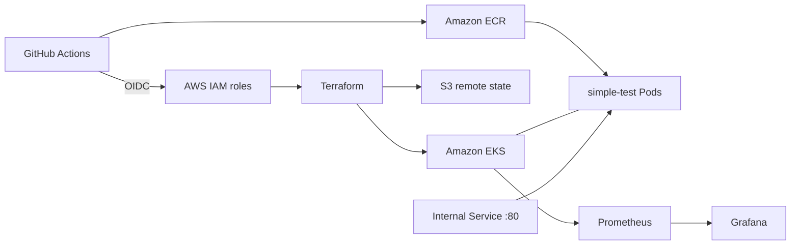

# EKS Learning Lab

A hands-on SRE lab for provisioning AWS infrastructure, deploying a containerized application, and investigating controlled Kubernetes failures using logs, events, and metrics.

The goal is to practice an evidence-based investigation: identify the symptom, compare healthy and unhealthy behavior, form a hypothesis, and validate recovery.

## What this project demonstrates

| Area | Implementation |
| --- | --- |
| Infrastructure as code | Terraform-managed EKS and supporting AWS infrastructure |
| Persistent state | S3 remote backend with bucket versioning |
| CI/CD authentication | GitHub Actions assuming AWS IAM roles through OIDC |
| Container delivery | Docker image stored in Amazon ECR and deployed to EKS |
| Application scaling | Two baseline replicas, with an HPA configured for two to four |
| Internal connectivity | Kubernetes ClusterIP Service exposing `simple-test` on port 80 |
| Observability | Prometheus, Grafana, Metrics Server, and lab dashboards and alert rules |
| Troubleshooting | Repeatable fault-injection and recovery workflows |

## Architecture

## Investigation exercises

| Exercise | Focus | Status |
| --- | --- | --- |
| Lab 01 | Container startup failures and comparing Pod configuration | Investigated in EKS |
| Lab 02 | CPU requests versus node allocatable capacity | Investigated and recovered in EKS |
| Lab 03 | Scheduling constraints and correlating events with dashboards | Investigated and recovered in EKS |
| Lab 04 | Internal application connectivity | Prepared for the next exercise |

Exercises are intended to preserve the investigation experience. The learner-facing guides explain how to start each scenario without giving away its root cause.

## Typical lab session

1. Run **Terraform Provision** to create the infrastructure.
2. Run **Deploy simple-test** for the initial application installation.
3. Run **Configure SRE observability** to configure and verify the lab dashboards and alert rules.
4. Follow the selected exercise guide to activate its scenario.
5. Investigate with `kubectl`, application logs, events, and Grafana; collect evidence before making changes.
6. Use the exercise's recovery procedure and verify the result.
7. Run **Terraform Decommission** when the session is complete.

These are manually triggered workflows. The initial application deployment and the update/scenario workflows have different purposes; use the corresponding guide when an application already exists.

## Playbooks and source

| Resource | Purpose |
| --- | --- |
| [Application playbook](docs/simple-test/playbook.md) | Build and deployment steps |
| [Kubernetes walkthrough](docs/simple-test/kubernetes-explained.md) | How the application components work together |
| [Lab 02 guide](docs/simple-test/lab-02-start.md) | Start and recover the second exercise |
| [Lab 03 guide](docs/simple-test/lab-03-start.md) | Start and recover the third exercise |
| [Lab 04 guide](docs/simple-test/lab-04-start.md) | Start and recover the fourth exercise |
| [GitHub Actions workflows](.github/workflows) | Provisioning, application delivery, S3 management, and lab operations |
| [Application source](application/simple-test) | Container image and NGINX configuration |
| [Kubernetes manifests](kubernetes/simple-test) | Deployment, Service, HPA, and access configuration |
| [Observability configuration](kubernetes/sre-observability) | Dashboard and alert definitions |
| [Lab scripts](scripts/sre) | Scenario automation and validation |
| [Terraform modules](modules) | Infrastructure components |

## Running this in another AWS account

Review the workflows, Terraform inputs, IAM trust policies, and backend configuration before running them. This repository contains lab-specific account, role, region, and resource settings; it is not a one-click template for arbitrary accounts. The Terraform state bucket must already exist before provisioning.

AWS resources incur charges while active. Decommission the lab after use and review persistent resources such as the state bucket and container registry separately. Preserve Terraform state for recovery and do not commit credentials or state files.

This is an educational environment, not a production reference architecture. The emphasis is repeatable practice, understandable automation, and evidence-based troubleshooting.
