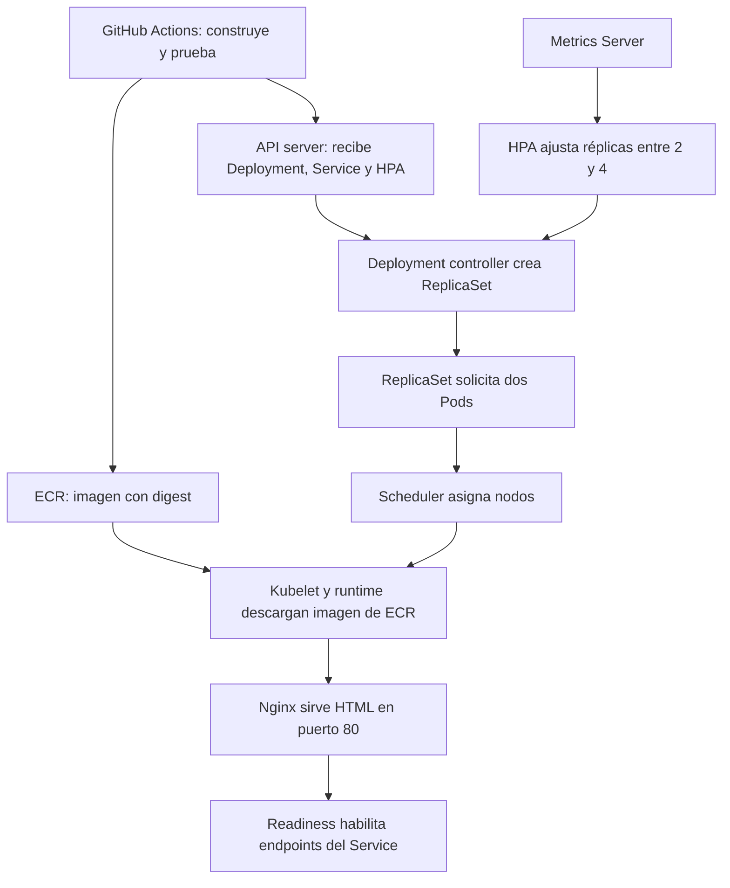

# Qué hace Kubernetes para ejecutar simple-test

## Del archivo al contenedor

1. **GitHub se autentica:** OIDC permite asumir `GitHubActionsSimpleTestRole`. IAM autoriza publicar la imagen y describir EKS. La entrada de acceso EKS y RBAC autorizan las operaciones Kubernetes.
2. **El API server acepta el estado deseado:** los manifiestos describen el resultado esperado. Guardar un Deployment no significa que sus Pods ya funcionen.
3. **Los controladores reconcilian:** el Deployment crea un ReplicaSet; este solicita inicialmente dos Pods. Si uno desaparece, el controlador busca recuperar la cantidad deseada.
4. **El scheduler decide dónde ejecutar:** considera CPU/memoria solicitadas y el selector AMD64. Si falta capacidad, un Pod puede quedar Pending.
5. **El nodo inicia el contenedor:** kubelet y el runtime descargan de ECR la imagen indicada por digest. Los nodos del laboratorio tienen permiso ECR de lectura; el permiso de publicación de GitHub no les concede ese acceso.
6. **Las probes comprueban el servicio:** startup permite arrancar, readiness decide si recibe tráfico y liveness detecta un contenedor que necesita reiniciarse. Se consulta `/healthz`.
7. **El Service conecta clientes y Pods:** el selector `app: simple-test` encuentra los Pods y Kubernetes mantiene sus EndpointSlices. Un Service ClusterIP presenta una dirección interna estable aunque cambien los Pods. La implementación de red del clúster encamina las conexiones a endpoints listos.

## Puertos y acceso interno

| Elemento | Puerto | Alcance |
|---|---:|---|
| Nginx dentro del contenedor | 80 | Atiende HTTP real |
| Service simple-test | 80 | Dirección virtual interna ClusterIP |
| Port-forward en la Mac | 8080 | localhost, mientras el túnel esté abierto |

Dentro del clúster: `http://simple-test.simple-test.svc.cluster.local:80`. En el mismo namespace también puede usarse `http://simple-test`. Desde la Mac: `http://localhost:8080`, después de iniciar el túnel. No hay LoadBalancer, Ingress ni DNS público.

`containerPort: 80` documenta el puerto: Nginx debe configurarse para escuchar ahí. El Service usa `targetPort: http`, que referencia ese puerto con nombre. Port-forward atraviesa el API de Kubernetes y selecciona un Pod; no es una prueba completa del tráfico normal del Service.

## Recursos y HPA

Cada Pod solicita **25m CPU y 32Mi RAM**, con límites **100m CPU y 64Mi RAM**. `1000m` equivale a una CPU. Son valores iniciales conservadores para esta página estática, no mínimos demostrados mediante pruebas de carga. Los requests ayudan al scheduler a reservar capacidad; los límites restringen consumo. Exceder el límite de memoria puede provocar OOMKilled; CPU puede sufrir throttling.

El HPA usa CPU media con objetivo **60% del request**: con 25m, corresponde aproximadamente a 15m por Pod. Solicita entre **2 y 4 réplicas** y estabiliza la reducción durante 300 segundos. El cálculo real incluye tolerancias, métricas disponibles y estado de los Pods. Metrics Server debe suministrar métricas; tener el manifiesto HPA no basta.

Dos es el mínimo y la cantidad inicial, no una cantidad fija. Bajo carga el HPA cambia el número deseado del Deployment. No crea nodos: si estos están llenos, puede haber réplicas Pending. Una página estática consume poca CPU, por lo que abrirla unas veces no garantiza escalado. La prueba de carga será un ejercicio separado.

Documentación: [HPA de Kubernetes](https://kubernetes.io/docs/concepts/workloads/autoscaling/horizontal-pod-autoscale/).

## Seguridad del contenedor

Nginx corre como usuario 101 sin root, sin capabilities y con sistema de archivos de solo lectura. `/tmp` es un volumen temporal escribible para PID y archivos temporales. El sysctl del Pod `net.ipv4.ip_unprivileged_port_start=0` permite escuchar en 80 sin root; pertenece a los sysctls seguros documentados por Kubernetes. El Pod no monta automáticamente un token Kubernetes porque servir HTML no requiere hablar con su API.

Documentación: [sysctls en Kubernetes](https://kubernetes.io/docs/tasks/administer-cluster/sysctl-cluster/).

## Qué garantiza el job

Prueba HTTP del contenedor antes de publicarlo, valida manifiestos contra el clúster, espera Pods disponibles y HPA activo, y prueba HTTP por túnel. No demuestra tolerancia a la caída de un nodo, escalado bajo carga ni seguridad de aislamiento entre namespaces. Dos Pods pueden compartir nodo; este laboratorio no configura distribución obligatoria.

Si un paso falla, se conservan recursos para investigar. Kubernetes puede seguir reconciliando después de que el job termine; un workflow fallido no implica que todos los recursos estén detenidos. Revisa el estado antes de reintentar o destruir.

## Para tus notas

Explica con tus palabras: ¿qué parte decide cuántos Pods hacen falta, cuál elige los nodos y cuál descarga la imagen? ¿Por qué cuatro réplicas no implican cuatro nodos?
