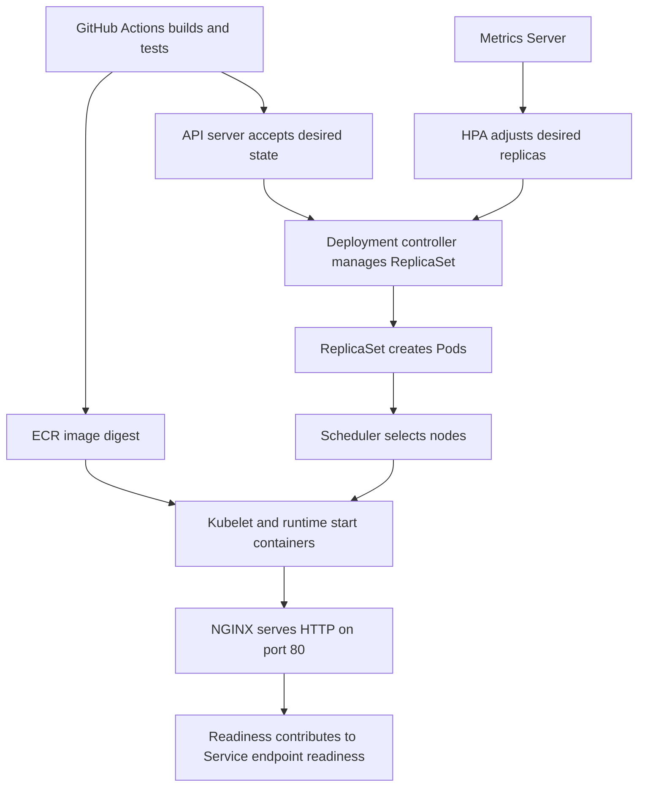

# How Kubernetes runs simple test

This guide follows the application from its manifests to a running container and explains which component owns each decision. It also describes the limits of the deployment workflow's health checks.

## From source to workload

GitHub uses OIDC to assume the deployment role. IAM permits the relevant AWS operations, while the EKS access entry and Kubernetes RBAC permit workload operations. The API server accepting a Deployment is only the beginning of reconciliation.

The Deployment controller manages ReplicaSets, which maintain the required Pod count. The scheduler considers resource requests and placement constraints. On the selected node, kubelet and the container runtime pull the digest from ECR and start the container. Nodes need their own image-pull authorization; GitHub's image-push permission does not supply it.

Startup, readiness, and liveness probes check `/healthz`. Startup gives the application time to initialize; readiness controls eligibility for normal Service traffic; repeated liveness failure can restart the container. A successful probe is evidence about that probe path, not every client request.

The ClusterIP Service selects application Pods and Kubernetes maintains EndpointSlices for them. The Service supplies a stable internal address while Pod addresses change. The cluster network routes traffic to eligible endpoints.

## Ports and access

| Component | Port | Scope |
| --- | --- | --- |
| NGINX process | 80 | Actual HTTP listener inside the container |
| simple-test Service | 80 | Internal ClusterIP |
| Optional Mac tunnel | 8080 | localhost while an authorized port-forward is running |

Internal URL: `http://simple-test.simple-test.svc.cluster.local:80/`. In the same namespace, the short Service name may be used. Public DNS, an application Ingress, and an external load balancer are not part of this application setup.

`containerPort: 80` declares the port; NGINX still has to listen on it. The Service's named target port references the container's `http` port. Port-forward uses the Kubernetes API and a selected Pod, so it is not a complete test of the normal Service path.

## Resources and scaling

The baseline container requests 25m CPU and 32Mi memory, with limits of 100m CPU and 64Mi memory. These are initial lab settings, not experimentally proven minimums. Requests influence placement; limits constrain consumption. Exceeding a memory limit can cause termination, while CPU limiting can cause throttling.

The HPA targets average CPU utilization at 60% of the request and allows two to four replicas. With a 25m request, 60% is approximately 15m per Pod. Its scale-down stabilization window is 300 seconds. Actual decisions also depend on metric availability, readiness, and tolerance. See the [Kubernetes HPA documentation](https://kubernetes.io/docs/concepts/workloads/autoscaling/horizontal-pod-autoscale/).

The HPA adjusts the Deployment's desired replicas; it does not add nodes. A replica can remain Pending if no eligible node has enough capacity. Light browsing of a static page does not guarantee enough CPU demand to trigger scaling.

## Container security

NGINX runs as user 101 without root, dropped Linux capabilities, and a read-only root filesystem. A writable temporary volume supplies runtime files. The configured Pod sysctl permits listening on port 80 without root. No Kubernetes service-account token is mounted automatically because serving HTML does not require API access. See [Kubernetes sysctls](https://kubernetes.io/docs/tasks/administer-cluster/sysctl-cluster/).

## What validation establishes

The initial workflow tests container HTTP before publishing, validates manifests against the cluster, waits for rollout and HPA activation, and tests HTTP through a tunnel. It does not prove node-failure tolerance, load-driven autoscaling, namespace isolation, or every Service traffic path. Two replicas can share a node because mandatory placement spreading is not configured.

Resources remain after a failed workflow so they can be investigated. Controllers may continue reconciling after the runner exits. Inspect current state before retrying or destroying.

## Review questions

Which controller maintains replica count? Which component chooses a node? Which component starts the image? Why do four replicas not imply four nodes? How can a Pod be Running while its application is unavailable to a particular client?
